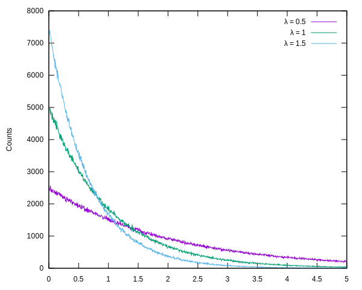

# Exponential deviates
`exp-dev` implements a pseudorandom number generator for the Exponential
distribution [1]. We use the `rate` parameter (λ). The PDF of the distribution
is:

λ . exp(-λ.x)

## Usage
A generator must be instantiated with proper rate parameter and then
numbers can be drawn from it. The rate can be read back from the generator
instance.

```common-lisp
(setf generator (exp-dev:make-exp-gen rate))
(exp-dev:draw generator) ;=> exponential deviate
(exp-dev:rate generator) ;=> rate
```

## Implementation
We use the simple method to draw an exponential deviate Y with rate λ:
Y ~ - ln(U) / λ with U an uniform variate between 0 and 1.

## Histogram
We check the histogram for the generated numbers with a few rate parameters:



## Test
Launch tests with:

```common-lisp
(asdf:test-system "exp-dev")
```

Includes a quick performance test.

## Dependencies
* `exp-dev`: None.
* `exp-dev/test`:
  * [rove](https://github.com/fukamachi/rove)

## References
1. https://en.wikipedia.org/wiki/Exponential_distribution
